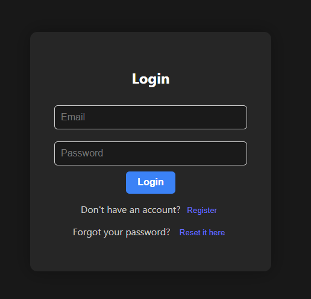
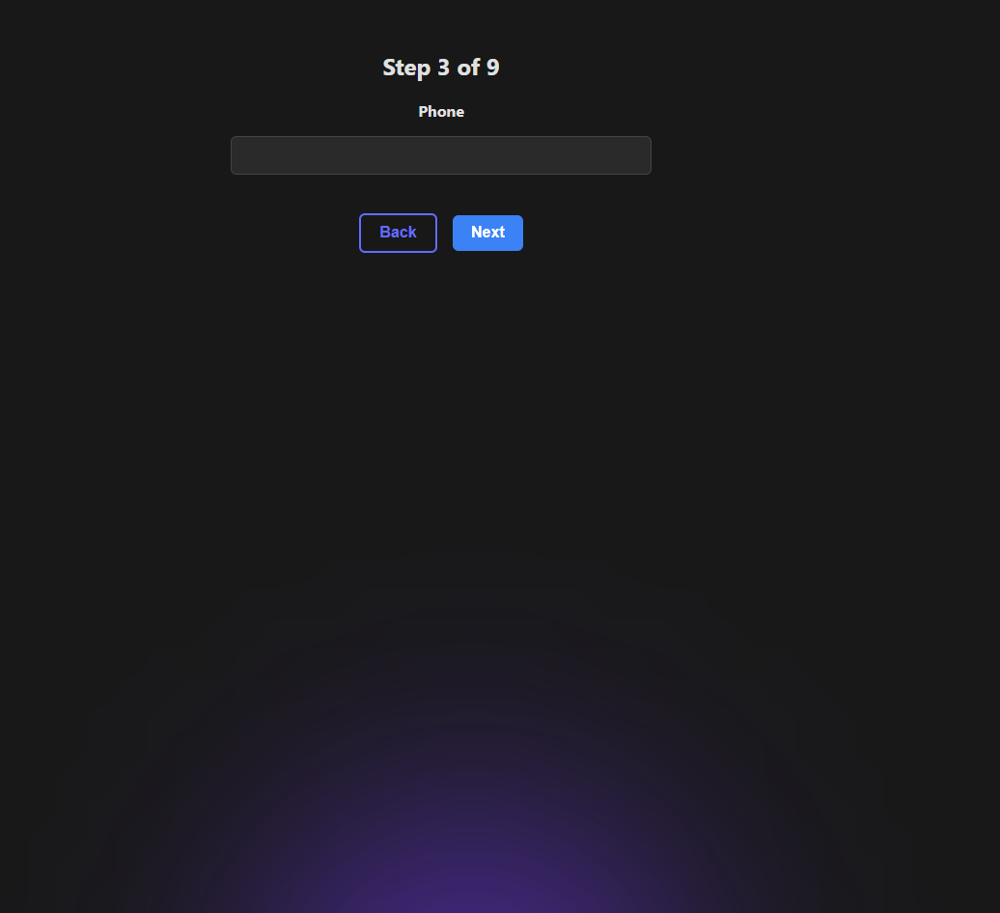
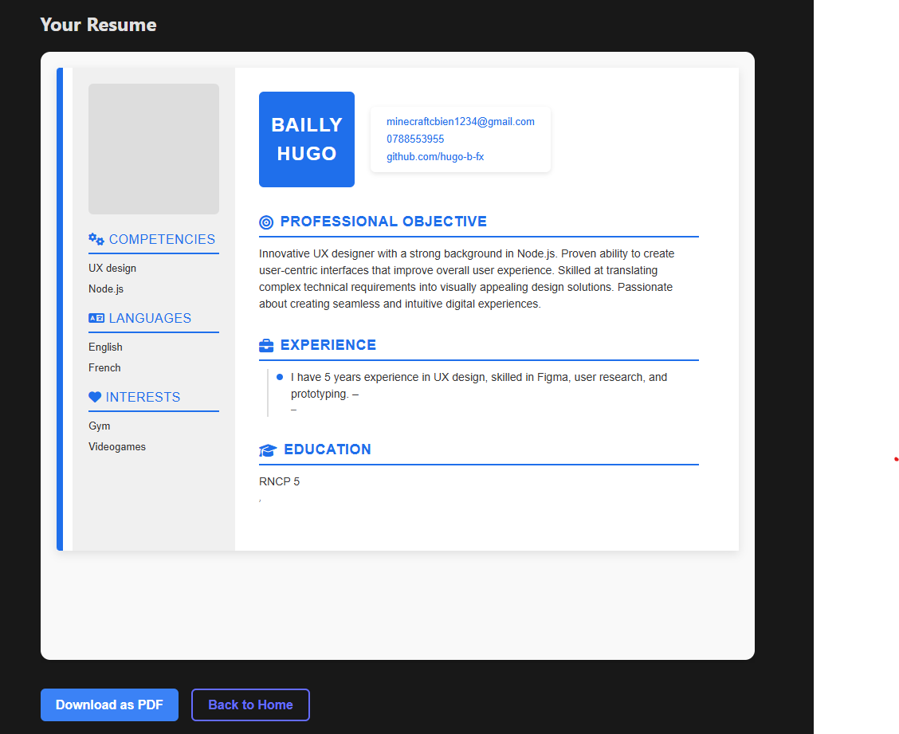

# 📄 JobFinderAI — AI-Powered Resume Builder

JobFinderAI is a full-stack web application that allows users to generate elegant and professional resumes using customizable HTML templates and AI-generated summaries. Users can log in, complete a step-by-step form, view a styled preview, and download their resume as a PDF — all from a responsive and intuitive interface.

---

## 🚀 Features

- 🔐 **Authentication** (Register/Login with JWT)
- 🧠 **AI Integration** (OpenAI for resume summary generation)
- 🎨 **HTML Template Engine** (Handlebars-based)
- 📸 **Photo Upload Support**
- 📥 **PDF Download** (via `html2pdf.js`)
- 💾 **Resume History** (Saved in MongoDB per user)
- 📱 **Fully Responsive Design**
- 🔁 **Password Reset Flow** (Secure reset via email link)
- 🌙 **Dark/Light Theme Toggle**

---

## 🛠️ Tech Stack

**Frontend:**

- React + React Router
- HTML/CSS (Responsive)
- Fetch API
- html2pdf.js

**Backend:**

- Node.js + Express
- MongoDB + Mongoose
- OpenAI API (ChatGPT)
- JWT Authentication
- Nodemailer (for password reset)

---

## 🖼️ Screenshots

| Login Page | Resume Form (Step-by-Step) | Resume Preview |
|------------|----------------------------|----------------|
|  |  |  |

---

## ⚙️ Installation

### 1. Clone the repository
```bash
git clone https://github.com/your-username/letterwizard.git
cd letterwizard
```

### 2. Setup backend
```bash
cd backend
npm install
```

Create a `.env` file in the backend root:

```env
MONGO_URI=your_mongodb_connection_string
JWT_SECRET=your_jwt_secret
OPENAI_API_KEY=your_openai_key
EMAIL_USER=youremail@gmail.com
EMAIL_PASS=your_email_password_or_app_password
```

Then start the server:
```bash
node server.js
```

### 3. Setup frontend
```bash
cd ../frontend
npm install
npm run dev
```

---

## 🔐 Environment Variables

Your `.env` file should contain the following:

```env
MONGO_URI=<MongoDB connection string>
JWT_SECRET=<your-secret>
OPENAI_API_KEY=<OpenAI API Key>
EMAIL_USER=<your email address>
EMAIL_PASS=<your email password or app password>
```

---

## ✨ Usage

1. Register or log in
2. Fill out the resume form step by step
3. Choose your template
4. Upload a photo (optional)
5. Preview the styled resume
6. Download as PDF
7. View resume history from your profile
8. Forgot password? Use the reset link sent to your email

---

## 📁 Folder Structure

```
letterwizard/
├── backend/
│   ├── routes/
│   ├── modules/
│   ├── middleware/
│   └── templates/
├── frontend/
│   ├── src/
│       └── App.css / App.jsx
```

---

## 💡 To Do

- [ ] Add more resume templates (modern, elegant, compact)
- [ ] Add user profile photo persistence
- [ ] Export to DOCX
- [ ] Resume editor with live preview

---

## 🧠 AI Prompt Example

```
You are an expert resume writer.
Write a professional, concise resume summary paragraph for a job applicant, in first person.

Candidate info:
- Name: John Doe
- Email: john@example.com
- Interests and skills: Frontend development, React, UX/UI

Make it formal, suitable for a resume, no greetings or closings.
Only return the summary.
```

---

## 👤 Author

**Hugo B.**  
Holberton School Rodez — RNCP5 
> Built as a personal project to learn React, Express, MongoDB, and AI integration.

---

## 📃 License

MIT License — Feel free to fork and customize for personal or educational use.
